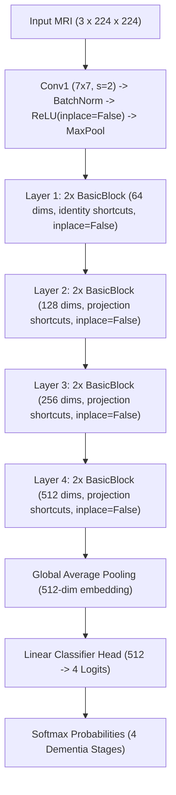

# Alzheimer’s Disease Detection Model (ResNet-18 + SHAP)

[](https://pytorch.org/)
[](https://github.com/slundberg/shap)
[]()
[]()
[]()

A hybrid research–engineering implementation for MRI-based Alzheimer’s disease severity classification and explainable AI (XAI).

---

## 📌 Overview

This repository implements a complete end-to-end deep learning and explainability pipeline for classifying structural brain MRI scans into four clinical Alzheimer’s disease severity stages:
1. **Non-Demented** (Cognitively Normal)
2. **Very Mild Dementia** (Early Mild Cognitive Impairment)
3. **Mild Dementia**
4. **Moderate Dementia**

The architecture features a modified **`SafeResNet-18`** backbone tailored to resolve autograd hook incompatibilities with **SHAP `GradientExplainer`** by eliminating all in-place activation operations (`inplace=False`). The training engine utilizes class-weighted cross-entropy loss to mitigate severe OASIS class imbalance, paired with an Adam optimizer and StepLR learning rate scheduling. Saliency maps provide transparent, clinically grounded visualizations of neuroanatomical changes, notably ventricular dilation and cortical thinning.

---

## 📖 Abstract

This work presents a ResNet-18–based classifier trained on the OASIS MRI dataset to detect Alzheimer’s disease severity across four classes. A weighted cross-entropy loss addresses class imbalance, and images are preprocessed to 224×224 with ImageNet standardization. SHAP GradientExplainer is integrated for model interpretability by disabling inplace ReLU operations.

The model achieves **98.90% accuracy**, **0.9787 macro precision**, **0.9954 macro recall**, and **0.9868 macro F1-score**, demonstrating strong discriminative performance across all classes. SHAP value maps provide clinically interpretable visualizations of brain regions contributing to predictions.

---

## 🔬 Key Engineering Features

- **SafeResNet-18 Architecture**: Standard ResNet-18 models use `nn.ReLU(inplace=True)` in their stem and residual blocks. PyTorch backward hooks in SHAP's `GradientExplainer` fail when tensors are mutated in place (`RuntimeError: modified by an inplace operation`). `SafeResNet18` recursively ensures all activations use `inplace=False`, enabling seamless gradient attribution.
- **Explainability Suite**:
  - **SHAP `GradientExplainer`**: Leverages validation background distributions to compute pixel-level Shapley values reflecting positive (pro-disease) and negative (counter-evidence) attributions.
  - **Grad-CAM Comparison Module**: Provides coarse convolutional feature attention from `layer4` alongside high-resolution SHAP pixel attributions.
- **Imbalance-Aware Optimization**: Automatically computes inverse class frequency weights $w_c = \frac{N}{C \cdot N_c}$ into CrossEntropyLoss.
- **Production-Ready Tooling**: Includes a modular CLI inference tool (`predict.py`) and a real-time clinical web dashboard (`app.py` via Streamlit).

---

## 📊 Benchmark Results

Performance evaluation on the OASIS validation split (80/20 train/val partition, 86,437 total images):

### Quantitative Metrics

| Metric | Value | Reference Page |
| :--- | :---: | :---: |
| **Accuracy** | **0.9890 (98.90%)** | Report p. 5 |
| **Macro Precision** | **0.9787** | Report p. 5 |
| **Macro Recall** | **0.9954** | Report p. 5 |
| **Macro F1-Score** | **0.9868** | Report p. 5 |
| **Mean Confidence** | **0.9882** | Report p. 5 |
| **Validation Loss** | **0.0170** | Report p. 5 |
| **Training Loss** | **0.0099** | Report p. 5 |

### Confusion Matrix Overview

The model demonstrates strong class separation with minimal off-diagonal confusion:

```
                      PREDICTED CLASS
                 Non-Dem    V.Mild     Mild      Mod
TRUE Non-Dem    [ 13,271       12         2        0  ]
     V.Mild     [     18    2,753         6        0  ]
     Mild       [      2        5       993        1  ]
     Mod        [      0        0         0       80  ]
```

- **Non-Demented**: 13,271 correctly classified
- **Very Mild Dementia**: 2,753 correctly classified
- **Mild Dementia**: 993 correctly classified
- **Moderate Dementia**: 80 correctly classified

---

## 🏗️ Model Architecture

The `SafeResNet-18` architecture follows the ResNet-18 residual backbone with specific adaptations:



---

## 📁 Repository Structure

```
Alzhiemer-Detection-Model/
│
├── data/                         # OASIS dataset directory & sample generator
│   └── generate_oasis_mock.py   # Synthesizes realistic MRI slices for instant testing
├── models/                       # Model weights and checkpoints (best_model.pth)
├── outputs_tcc_resnet18/         # Metrics, training curves, confusion matrix, ROC plots
├── shap_analysis/                # SHAP heatmaps, class contribution plots, Grad-CAM maps
├── train.py                      # Training script with StepLR & class weighting
├── model.py                      # SafeResNet18 implementation (inplace=False, 512->4)
├── shap_explain.py               # SHAP GradientExplainer & Grad-CAM integration
├── utils.py                      # Preprocessing transforms, loss, metrics, plotting
├── predict.py                    # Inference CLI for single-scan diagnosis & SHAP output
├── api.py                        # Production REST API backend (aiohttp)
├── app.py                        # Streamlit web application for interactive diagnosis
├── requirements.txt              # Environment dependencies
└── README.md                     # Project documentation and report alignment
```

---

## 🚀 Installation & Setup

### 1. Clone the Repository
```bash
git clone https://github.com/Saurabh89580/Alzhiemer-Detection-Model.git
cd Alzhiemer-Detection-Model
```

### 2. Create and Activate Virtual Environment
```bash
# Windows
python -m venv .venv
.\.venv\Scripts\activate

# Linux / macOS
python3 -m venv .venv
source .venv/bin/activate
```

### 3. Install Dependencies
```bash
pip install -r requirements.txt
```

---

## 💻 Usage

### 1. Prepare Dataset
To generate sample MRI data with simulated neurodegenerative progression for immediate verification:
```bash
python data/generate_oasis_mock.py --train_samples 40 --val_samples 10
```
*(To use the full Kaggle OASIS dataset, place the raw scans into `data/train/` and `data/val/` categorized by class folder).*

### 2. Train the Model
```bash
python train.py --epochs 10 --batch_size 32 --lr 1e-4 --step_size 5 --gamma 0.1
```
Output checkpoints are saved to `models/best_model.pth` and visual loss/ROC curves are written to `outputs_tcc_resnet18/`.

### 3. Generate SHAP Explanations
```bash
python shap_explain.py --model_path models/best_model.pth --output_dir shap_analysis
```
This produces:
- High-resolution attribution heatmaps highlighting positive/negative evidence in `shap_analysis/`.
- Side-by-side Grad-CAM comparisons and class confidence bars.

### 4. Single-Scan Inference CLI
```bash
python predict.py --image data/val/Mild_Dementia/oasis_val_Mild_Dementia_0000.jpg
```

### 5. Launch the Interactive Web Dashboard
```bash
streamlit run app.py
```
Open your browser at `http://localhost:8501` to upload scans, run real-time predictions, and generate interactive SHAP attribution maps.

---

## 🗺️ Roadmap & Future Work
- [x] Integrate `SafeResNet-18` with strictly non-in-place operations
- [x] Add Grad-CAM comparison module alongside SHAP `GradientExplainer`
- [x] Build interactive clinical web dashboard
- [ ] Extend SHAP to multi-sample cohort summaries and cluster attributions
- [ ] Implement EfficientNet and Vision Transformer (ViT) ensemble benchmarking
- [ ] Automated Bayesian hyperparameter tuning with Optuna
- [ ] RESTful FastAPI inference endpoint for PACS hospital integration

---

## 📜 Citation & Acknowledgements
- **Dataset**: [Open Access Series of Imaging Studies (OASIS)](https://www.oasis-brains.org/)
- **SHAP**: Lundberg, S. M., & Lee, S.-I. (2017). *A Unified Approach to Interpreting Model Predictions*. NeurIPS.
- **ResNet**: He, K., Zhang, X., Ren, S., & Sun, J. (2016). *Deep Residual Learning for Image Recognition*. CVPR.
